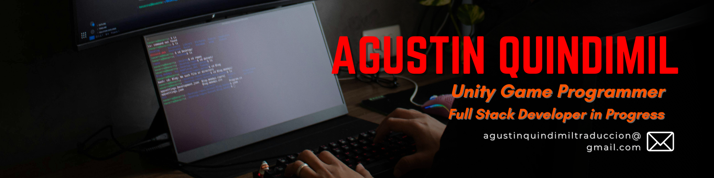

# 💫 About Me:
🔭 I’m currently working on a multiplayer FPS game with Photon Unity 
👯 I’m looking to collaborate on Unity 3D Games or Websites 
🌱 I’m currently learning NodeJS 
⚡ Fun fact: I’m a One Piece fan and currently on Fishman Island, so please no spoilers!

## 🌐 Socials:
 
 
 

# 💻 Tech Stack:
**Languages:**  
 
 
 

**Frontend:**  
 
 
 
 
 
 

**Backend / Hosting:**  
 
 

**Game Dev / Design:**  
 
 
 
 
 

**Tools:**  
 

# 📊 GitHub Stats:
 
 

---

<!-- Proudly created with GPRM ( https://gprm.itsvg.in ) -->
